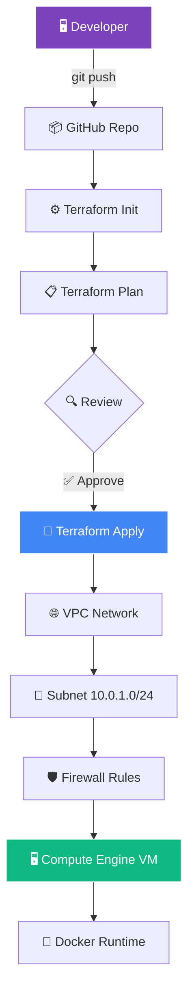

<!-- ═══════════════════════════════════════════════════════════════ -->
<!-- 🏗️ Terraform GCP Infrastructure — Fresh Terminal README -->
<!-- Bold Typography · Terminal Window · No capsule-render       -->
<!-- ═══════════════════════════════════════════════════════════════ -->

<!-- ═══════ BOLD TYPOGRAPHY HEADER ═══════ -->
<div align="center">

<br/>

<h1>
  
</h1>

<h3>
  
</h3>

<br/>


<br/>

</div>

<!-- ═══════ TERRAFORM TERMINAL WINDOW ═══════ -->
<div align="center">


</div>

<br/>

<!-- ═══════ STATUS BADGES ═══════ -->
<div align="center">


</div>

<br/>

<!-- ═══════ LIVE GITHUB BADGES ═══════ -->
<div align="center">
  <a href="https://github.com/sumit966/terraform-gcp-infrastructure/stargazers">
    
  </a>
  <a href="https://github.com/sumit966/terraform-gcp-infrastructure/network/members">
    
  </a>
  <a href="https://github.com/sumit966/terraform-gcp-infrastructure/issues">
    
  </a>
  <a href="https://github.com/sumit966/terraform-gcp-infrastructure/commits/main">
    
  </a>
</div>

<br/>

<!-- ═══════ TECH STACK BADGES ═══════ -->
<div align="center">
  
  
  
  
  
</div>

<br/>

<!-- ═══════ AI SCENES ═══════ -->
<div align="center">
  
  
  
</div>

<br/>

<div align="center">
  <i>🏗️ DevOps Project · Author: <b>Sumit Raj</b> · M.Tech VNIT Nagpur · Ex-Salesforce</i>
</div>

<br/>


---

## 🎯 Overview


**Infrastructure as Code (IaC)** for provisioning **GCP infrastructure** using **Terraform**:

<table>
<tr>
<td width="25%" align="center">

### 🌐 VPC


Custom VPC

</td>
<td width="25%" align="center">

### 🔀 Subnet


Regional subnet

</td>
<td width="25%" align="center">

### 🛡️ Firewall


Ingress rules

</td>
<td width="25%" align="center">

### 🖥️ Compute


VM instance

</td>
</tr>
</table>

> **🎯 Purpose:** One command to provision **complete GCP infrastructure** — VPC, subnets, firewall rules, and a Compute Engine VM with Docker.

---

## ❌ Problem Statement

Manual cloud infrastructure setup is:

| ❌ Issue | Impact |
|---------|--------|
| 🖱️ **ClickOps** — manual console work | Slow, error-prone |
| 📝 **No version control** | Can't track changes |
| 🔄 **Not reproducible** | "Works on my machine" |
| 👥 **Team conflicts** | No single source of truth |
| 🐛 **Hard to debug** | No audit trail |

> **Cloud infrastructure needs to be code — versioned, reviewable, reproducible.**

---

## ✅ Solution

**Terraform IaC** that:

- 📝 **Declares infrastructure as code** — VPC, subnet, firewall, VM
- 🔄 **Is idempotent** — `terraform apply` always converges to desired state
- 🏗️ **Uses modules** — reusable across environments
- 🌍 **Supports multi-env** — dev and prod variable files
- 🔐 **Manages state** — remote state support
- ⚡ **One-command deploy** — `terraform apply`

---

## 🏗️ Architecture

### ☁️ GCP Infrastructure Flow



### 📐 ASCII Fallback

```
VPC Network
    |
    ├── Subnet 10.0.1.0/24
    |       |
    |       └── Compute Engine VM (Ubuntu + Docker)
    |
    └── Firewall Rules
            ├── SSH (22)
            ├── HTTP (80)
            └── HTTPS (443)
```

---

## 🛠️ Tech Stack

<table align="center">
<tr>
<td><b>Category</b></td>
<td><b>Technologies</b></td>
</tr>
<tr>
<td>🏗️ IaC</td>
<td></td>
</tr>
<tr>
<td>☁️ Cloud</td>
<td> </td>
</tr>
<tr>
<td>📝 Config</td>
<td></td>
</tr>
<tr>
<td>🐳 Runtime</td>
<td> </td>
</tr>
<tr>
<td>🔐 Auth</td>
<td></td>
</tr>
<tr>
<td>🐍 Language</td>
<td></td>
</tr>
</table>

---

## 📦 Project Structure

```
terraform-gcp-infrastructure/
│
├── 🏗️ main.tf                     # Provider + core config
├── 📋 variables.tf                 # Input variables
├── 📤 outputs.tf                   # Output values
├── 🌐 vpc.tf                       # VPC + subnet + firewall
├── 🖥️ compute.tf                   # Compute Engine VM
│
├── 📜 scripts/
│   └── startup.sh                  # VM startup script
│
├── 🌍 environments/
│   ├── 📁 dev/
│   │   └── terraform.tfvars        # Dev variables
│   └── 📁 prod/
│       └── terraform.tfvars        # Prod variables
│
├── 🚫 .gitignore
├── 📜 LICENSE
└── 📖 README.md
```

---

## 🚀 Quick Start

<div align="center">
  
  
  
</div>

<br/>

### 1️⃣ Install Terraform

```bash
# macOS
brew install terraform

# Windows (choco)
choco install terraform
```

### 2️⃣ Authenticate to GCP

```bash
gcloud auth application-default login
```

### 3️⃣ Clone

```bash
git clone https://github.com/sumit966/terraform-gcp-infrastructure.git
cd terraform-gcp-infrastructure
```

### 4️⃣ Initialize

```bash
terraform init
```

### 5️⃣ Plan

```bash
terraform plan -var-file="environments/dev/terraform.tfvars"
```

### 6️⃣ Apply

```bash
terraform apply -var-file="environments/dev/terraform.tfvars"
```

---

## 📋 Resources Created

<table align="center">
<tr>
<td width="25%" align="center">

### 🌐 VPC Network


Isolated network

</td>
<td width="25%" align="center">

### 🔀 Subnet


Regional subnet

</td>
<td width="25%" align="center">

### 🛡️ Firewall


Ingress rules

</td>
<td width="25%" align="center">

### 🖥️ Compute Engine


VM instance

</td>
</tr>
</table>

---

## 🔧 Configuration

### 🌍 `environments/dev/terraform.tfvars`

```hcl
project_id   = "your-gcp-project-id"
region       = "asia-south1"
zone         = "asia-south1-a"
machine_type = "e2-small"
vm_name      = "dev-vm"
```

### 🌍 `environments/prod/terraform.tfvars`

```hcl
project_id   = "your-gcp-project-id"
region       = "asia-south1"
zone         = "asia-south1-a"
machine_type = "e2-medium"
vm_name      = "prod-vm"
```

---

## 📤 Outputs

After `terraform apply`, you get:

| Output | Description |
|--------|-------------|
| 🌐 `vpc_name` | Name of the created VPC |
| 🔀 `subnet_name` | Name of the subnet |
| 🖥️ `vm_external_ip` | Public IP of the VM |
| 🐳 `vm_name` | Name of the Compute Engine instance |

---

## 🧪 Testing

```bash
# Validate syntax
terraform validate

# Format check
terraform fmt -check

# Plan dry-run
terraform plan -var-file="environments/dev/terraform.tfvars"
```

---

## 🗺️ Roadmap

- [x] ✅ VPC + Subnet + Firewall
- [x] ✅ Compute Engine VM
- [x] ✅ Startup script with Docker
- [x] ✅ Multi-environment support
- [ ] 🚧 Remote state (GCS backend)
- [ ] 🚧 Cloud SQL instance
- [ ] 🚧 Load balancer
- [ ] 🚧 CI/CD with GitHub Actions
- [ ] 🚧 Monitoring + logging

---

## 🎓 Key Learnings

<table>
<tr>
<td width="50%" valign="top">

### 🏗️ IaC Insights

- 📝 **Terraform state** is the single source of truth
- 🔄 **Idempotency** means safe re-application
- 🌍 **Multi-env** via variable files
- 🔐 **Remote state** prevents team conflicts

</td>
<td width="50%" valign="top">

### ☁️ GCP Insights

- 🌐 **VPC** isolates resources
- 🛡️ **Firewall rules** are stateful
- 🖥️ **Startup scripts** automate VM bootstrap
- 🐳 **Docker on VM** for app deployment

</td>
</tr>
</table>

---

## 👤 Author

<div align="center">


<br/><br/>

<b>M.Tech Applied AI & ML @ VNIT Nagpur</b><br/>
<i>Ex-Software Engineer Intern @ Salesforce</i>

<br/><br/>

<a href="https://sumit966.github.io">
  
</a>
<a href="https://www.linkedin.com/in/er-sumit-raj-/">
  
</a>
<a href="https://github.com/sumit966">
  
</a>
<a href="mailto:info.sr0909@gmail.com">
  
</a>

<br/><br/>


</div>

---

## 📄 License

<div align="center">


<br/>


<br/><br/>

<samp>
Released under the <b>MIT License</b> — see <a href="LICENSE">LICENSE</a> file.
</samp>

<br/><br/>

<sub><samp>© 2025 &nbsp;·&nbsp; SUMIT RAJ &nbsp;·&nbsp; ALL RIGHTS RESERVED</samp></sub>

<br/>


</div>
